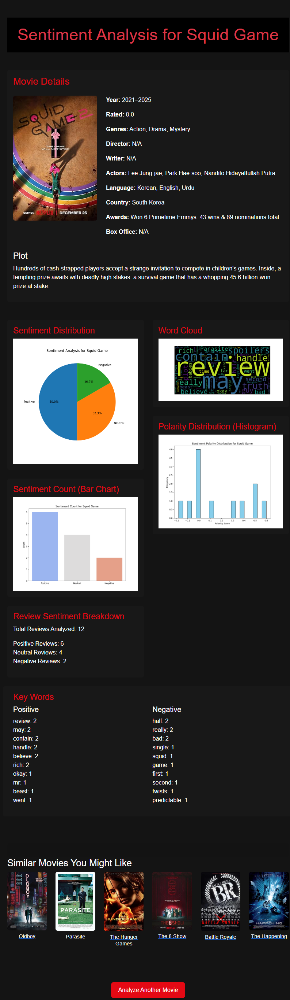

# Sentiment Analysis on movie reviews

## Steps for installing the required packages

- Download Python
-  Unzip the project file
-  Open CMD in the folder. i.e the at the location of the project folder
-  Now run  ``` pip install -r requirements.txt ```  
-  Once all the above steps are done. Run the following command
-  ``` python app.py ```
-  Now copy the IP address displayed and paste it in the terminal
  
<br>

## Steps to use the program

- Once all the above steps are complete. You will have following window

<br>


<br>

  ### Now search for the exact name of the movie you want for sentimental analysis.


## Result will be as follows:


## Additional features
  ### Added a feature to search for a movie by it's title instead of URL.
  ### Added a feature to suggest movies to the user based on the movie that they have searched.


